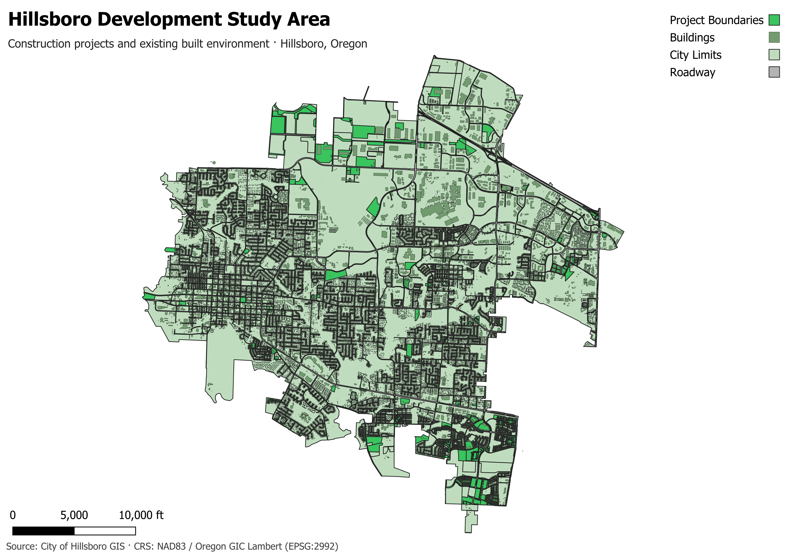
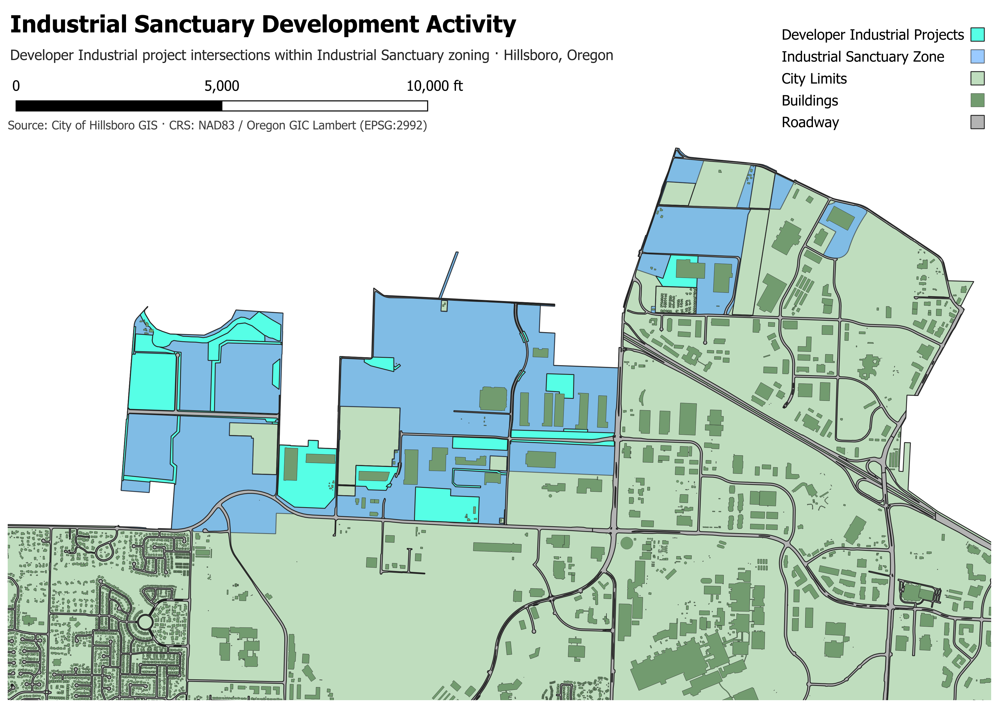

# Hillsboro, Oregon: Development, Land Use, and the Built Environment

**Study Area:** Hillsboro, Oregon  
**Data Snapshot:** September 15, 2026

**A reproducible GIS case study of construction projects, zoning, comprehensive planning, and building age**

> **At a glance:** I built a reproducible spatial-analysis workflow using municipal GIS data, Python, QGIS, and spreadsheet analysis to examine where Hillsboro's construction projects intersect industrial zoning, planned land uses, and existing buildings.

**Key findings**

- **Industrial activity is concentrated in a distinctive planning context.** Within the examined *Developer Industrial* project intersections with *Industrial Sanctuary* zoning, infrastructure accounts for **46.1%** of measured intersection acreage, data-center projects for **35.7%**, and other projects for **18.1%**. These are shares of a **23.55-acre analytical subset**, not of all citywide development.
- **Industrial land uses account for a substantial share of project overlap with comprehensive-plan designations.** The Industrial designation represents approximately **44.5 acres**, or **46%** of the measured project–plan intersection acreage in this analysis.
- **Project-associated buildings skew toward recent construction.** Of **1,028 distinct buildings** identified as intersecting construction-project boundaries, **856** were recorded as built in **2010 or later**. This describes the spatially associated building inventory, not buildings necessarily constructed by the projects.

**Tools:** Python · ArcGIS REST services · GeoPackage · QGIS · spreadsheet pivot tables and charts  
**Project:** [Source code and methodology on GitHub](https://github.com/Masyczek/hillsborogis)

---

## 1. Executive Summary

Hillsboro, Oregon, is a significant employment and development center in the Portland metropolitan area, with a prominent industrial and semiconductor-related business presence. I selected Hillsboro for a GIS learning project because its development patterns and industrial geography are relevant to the region where I hope to work and live. The study offered an opportunity to apply reproducible data preparation and spatial analysis to a practical question: **How is Hillsboro growing, and how does current development relate to zoning, long-term planning, and the existing built environment?**

I assembled a snapshot of publicly available municipal geographic data, prepared it in Python, and used QGIS to evaluate three relationships: construction projects and zoning districts; construction projects and comprehensive-plan designations; and construction projects and building age. The outputs include mapped study areas, spatial-intersection tables, and charts designed to make the results understandable without requiring the reader to operate GIS software.

The clearest result emerged from a closer examination of *Developer Industrial* projects intersecting *Industrial Sanctuary* zoning. Within that specific subset, projects classified as infrastructure and data centers collectively account for approximately **81.8% of measured intersection acreage**. The comprehensive-plan analysis provides a broader perspective, showing that the Industrial planned-land-use category represents a large share of project overlap. The building analysis, meanwhile, shows that the inventory of buildings associated spatially with mapped project boundaries is heavily weighted toward buildings recorded as constructed since 2010.

These results are **spatial associations**, not causal findings. A project boundary intersecting a zoning district does not imply that its entire area is under construction; likewise, a building intersecting a project boundary is not necessarily a product of that project. The value of the study lies in making those relationships measurable, interpretable, and reproducible.

## 2. Research Question and Study Area

### Research question

**How is Hillsboro growing, and how does current development relate to zoning, long-term planning, and the existing built environment?**

I organized the investigation around three supporting questions:

1. Which zoning districts overlap mapped construction projects, and what kinds of projects account for notable concentrations?
2. How does project activity intersect the city's comprehensive-plan land-use designations?
3. What is the age distribution of existing buildings associated with construction-project boundaries, and how does it vary by project type?

Hillsboro offers a useful case study because its geography includes established neighborhoods, new residential development, transportation and utility infrastructure, and specialized industrial districts. The city's *Industrial Sanctuary* zoning is especially relevant to understanding the geography of industrial projects. At the same time, comparing projects with the comprehensive plan and existing buildings broadens the analysis beyond any single industry.

*Figure 1. Hillsboro development study area. The map locates construction-project boundaries in the context of the existing built environment and municipal boundary.*

## 3. Data and Methodology

### Data Snapshot

The datasets used in this study were retrieved from the City of Hillsboro's public GIS services on September 15, 2026, and preserved as a fixed snapshot to support reproducible analysis. All findings reflect municipal records available on that date rather than continuously updated construction or land-use conditions.
### Data acquisition and preparation

The workflow begins with publicly accessible City of Hillsboro GIS services. I retrieved relevant layers through ArcGIS REST endpoints and used Python notebooks and scripts to inspect attributes, preserve source metadata, clean fields, and prepare local analytical datasets. Where source fields used coded values, I retained or generated readable labels to support interpretation and charting.

The principal datasets used in this report were:

| Dataset | Analytical role |
| --- | --- |
| Construction project boundaries (`HIL-002`) | Project locations and project-type attributes |
| Zoning (`HIL-003`) | Current zoning districts for project-overlap analysis |
| Comprehensive plan (`HIL-004`) | Planned land-use designations for project-overlap analysis |
| Building footprints (`HIL-005`) | Existing building locations and recorded construction years |
| City limits (`HIL-008`) | Municipal study-area context |
| Roadways (`HIL-009`) | Geographic orientation in map figures |

I used **GeoPackage** as a portable local format for QGIS analysis. The GIS project and supporting notebooks are retained in the repository to document how the analytical outputs were produced.

### Spatial analysis

QGIS provided the primary spatial-analysis environment. The source GIS layers were originally provided in different coordinate reference systems (CRS) and were reprojected to a common projected CRS, **NAD83 / Oregon GIC Lambert (EPSG:2992)**, before spatial analysis. This standardization ensured consistent spatial alignment and a common measurement system for area calculations.

Because EPSG:2992 uses feet, polygon intersection areas were converted from square feet to acres using **43,560 square feet per acre**.

Three relationships formed the analytical core:

- **REL-001 — Projects × Zoning:** Intersect project boundaries with zoning polygons; summarize overlap acreage by project type and zoning district; examine the *Developer Industrial × Industrial Sanctuary* subset in detail.
- **REL-002 — Projects × Comprehensive Plan:** Intersect project boundaries with comprehensive-plan polygons; summarize project overlap by planned land use and project type.
- **REL-003 — Projects × Buildings:** Associate building footprints with project boundaries; evaluate building-era distributions and project-type composition, using distinct building counts for the overall inventory.

I exported or summarized the resulting attribute tables for pivot-table analysis and chart creation. The charts complement the maps: maps explain **where** relationships occur, while tabular summaries explain **how much** overlap exists and **how the composition differs**.

### Interpretation rule

**“Intersection acreage” is the area where two mapped polygons overlap.** It is not equivalent to permitted floor area, developed land area, construction footprint, or the acreage of a completed project. Similarly, a spatial intersection between a building and a project boundary establishes geographic overlap, not a construction date or causal relationship between the two records.

## 4. REL-001 — Construction Projects and Zoning

The first analysis compares mapped construction-project boundaries with zoning districts. An initial cross-tabulation of **project intersection acreage by development type and zoning district** identified *Developer Industrial* projects intersecting *Industrial Sanctuary* zoning as a useful area for closer examination.

*Figure 2. Construction project acreage by development type and zoning district. This exploratory comparison motivated the Industrial Sanctuary drilldown.*

Rather than interpreting that aggregate as a single kind of industrial construction, I reviewed the individual project records and grouped the relevant projects by their documented purpose. This produced a more informative distinction among **infrastructure**, **data centers**, and **other** development.

*Figure 3. Industrial Sanctuary development activity. The highlighted project polygons depict the measured intersections of Developer Industrial project boundaries with Industrial Sanctuary zoning, not the full extent of every underlying project.*

### Industrial Sanctuary drilldown

| Project-purpose classification | Intersection acreage | Share of subset |
| --- | ---: | ---: |
| Infrastructure | 10.87 | 46.1% |
| Data centers | 8.41 | 35.7% |
| Other | 4.27 | 18.1% |
| **Total** | **23.55** | **100.0%** |

*Figure 4. Composition of Developer Industrial project intersection acreage within Industrial Sanctuary zoning. Percentages are rounded.*

The data-center category includes records associated with operators and developments such as Aligned, Digital Realty, QTS, STACK, and T5. The infrastructure category includes projects with descriptions relating to stormwater, roads, corridors, and other supporting improvements. The remaining category includes projects not assigned to those two purposes, including Sewell Corporate Park Phase II.

**Infrastructure and data-center projects together account for approximately 81.8% of this 23.55-acre subset.** That concentration is noteworthy, but it does **not** establish that every infrastructure project supports a data center, nor does it describe the share of development across all of Hillsboro. The project-purpose grouping is an analytical classification based on reviewed project records, rather than a direct zoning designation.

This progression—from an aggregate zoning comparison to a project-level drilldown—illustrates an important analytical practice: a strong pattern in a chart is a starting point for investigation, not a sufficient explanation by itself.

## 5. REL-002 — Construction Projects and Planned Land Use

Zoning describes the regulatory land-use framework, while the comprehensive plan provides a longer-term view of intended land use. To examine this distinction, I intersected the same construction-project boundaries with comprehensive-plan polygons and summarized their overlap acreage by project type and planned-land-use category.

*Figure 5. Construction project activity by planned land use, measured as project-boundary intersection acreage.*

The **Industrial** planned-land-use category accounts for approximately **44.5 acres**, or about **46%** of measured project–plan overlap in the summarized results. Within that category, the *Developer Industrial* project type contributes approximately **28.17 acres** of overlap.

The chart also shows residential project activity concentrated in residential and mixed-use designations, rather than distributed uniformly across the city's planned-land-use categories. Within the residential portion of the analysis, **Medium Density Residential** is a prominent overlap category.

These results are consistent with meaningful differences in where industrial and residential project boundaries appear relative to the city's planning framework. They should not be read as a formal determination of plan compliance: spatial overlap alone cannot establish whether a project conforms to every applicable policy, permit, or development condition.

Taken together, REL-001 and REL-002 provide complementary perspectives. The zoning analysis identifies the regulatory districts associated with project footprints; the comprehensive-plan analysis places those footprints in the context of the city's longer-term land-use structure.

## 6. REL-003 — Construction Projects and Building Age

The third analysis examines the existing built environment rather than land-use designations. I associated building footprints with construction-project boundaries and compared the distribution of recorded building years across project types.

Across the analyzed project intersections, **1,028 distinct buildings** were identified. Of those, **856 buildings**—approximately **83%**—had recorded construction years of **2010 or later**. This is a descriptive result for buildings spatially associated with the project dataset, not a statement about the age distribution of all buildings in Hillsboro.

*Figure 6. Project type distribution by building era. Each 100% stacked column shows the mix of project types within that building-era group; it does not show the absolute number of buildings in each era.*

The project-type breakdown reveals an especially strong association between **Developer Residential** project boundaries and newer buildings: **817 of 867** buildings in that project-type grouping were recorded as built in **2010 or later**, approximately **94.2%**. By contrast, **CIP Sanitary/Storm** project intersections include a greater representation of older building eras, particularly **1970–1989**.

This contrast is plausible given the different spatial settings of residential development and infrastructure improvements, but the dataset does not establish why a particular project overlaps buildings of a given age. A sanitary or stormwater improvement may pass through an established neighborhood without replacing its buildings. Likewise, a recently built building inside a residential project boundary cannot automatically be attributed to that project record.

The 100% stacked visualization is most useful for comparing **composition within each building era**. Absolute building counts, reported separately above, are necessary to understand the overall scale of the associations.

## 7. Limitations and Data Quality

Several limitations are central to interpreting this study responsibly.

**Project boundaries are not construction footprints.** Project polygons describe the spatial extents recorded in the municipal dataset. Their intersection acreage with zoning or plan polygons should not be treated as the amount of land physically disturbed, built upon, or completed.

**The dataset is a snapshot.** All datasets were acquired on September 15, 2026. The findings reflect municipal GIS records available at that time, not current construction conditions. Project boundaries, zoning designations, and building records may have changed since acquisition.

**Spatial overlap is not causation or regulatory approval.** The relationship between a project and a zoning or plan designation is geographic. It does not prove that the designation caused the project, that a project is fully compliant, or that a building was constructed as part of an intersecting project.

**Building-year data require care.** The building dataset includes records with missing, unknown, or placeholder construction years. Year-based summaries depend on the treatment of those values. The analysis should not interpret a placeholder such as `0` as a genuine construction year.

**Intersection outputs can contain repeated source features.** A single project may intersect multiple zoning or plan polygons; a building may also be associated with more than one project boundary. Acreage totals and building counts therefore answer different questions. The overall REL-003 building figure is a **distinct-building count**; category-level associations should not be summed indiscriminately as though every building belongs to exactly one project type.

**Project-purpose categories involve judgment.** The Industrial Sanctuary drilldown groups reviewed project records into three practical analytical categories. Those categories aid interpretation but are not presented as an official City of Hillsboro classification system.

**Geographic and thematic scope is limited.** This case study examines selected municipal layers and three defined spatial relationships. It does not estimate citywide construction spending, jobs created, semiconductor output, or total developed acreage.

These constraints do not invalidate the results. They define precisely what the maps and charts can—and cannot—support.

## 8. Conclusion

This project began as an opportunity to learn and apply GIS in a region of personal and professional interest. It developed into an end-to-end spatial-analysis case study: acquiring public data, preserving a reproducible snapshot, preparing attributes in Python, running spatial operations in QGIS, and turning the resulting tables into interpretable maps and charts.

Three conclusions stand out. First, the zoning analysis revealed a notable concentration of *Developer Industrial* project overlap within *Industrial Sanctuary* zoning; project-level review showed that infrastructure and data-center purposes account for most of the measured acreage **within that specific subset**. Second, the comprehensive-plan analysis placed a substantial portion of project overlap in land designated for industrial use, while showing different patterns for residential project types. Third, the building analysis demonstrated that buildings associated with the mapped project boundaries skew heavily toward recent construction, with meaningful differences across project types.

The broader lesson is methodological: **spatial data become more useful when exploratory patterns are followed by careful classification, appropriate denominators, and explicit limitations**. The results provide a structured view of Hillsboro's development geography while leaving room for further questions that would require additional datasets or temporal analysis.

For readers interested in the implementation, the [GitHub repository](https://github.com/Masyczek/hillsborogis) contains the supporting code and project materials. The report is intended to be readable on its own; the repository provides a path to examine how the work was performed.

---

*Data attribution: City of Hillsboro public GIS datasets. Maps and analysis prepared independently for a portfolio case study. This report is not an official City of Hillsboro publication.*
